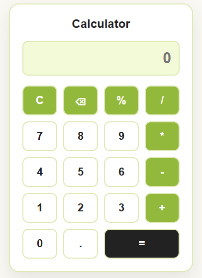

<h1 align="center">Calculator</h1>


<p align="center">
  
A responsive calculator web application that performs basic arithmetic operations, percentage calculations, and input management. Built with HTML, CSS, and JavaScript while practicing DOM manipulation and event handling.</p>

<p align="center">
  <strong><a href="https://procompute.netlify.app/">🌐 Live Demo</a></strong>
</p>

---

##  Preview

<p align="center">
  
</p>

<!--##  Demo
<p align="center">
  
</p>
----->

##  Features

- Basic arithmetic operations (add, subtract, multiply, divide)
- Percentage conversion
- Backspace (⌫) to delete the last character
- Clear (C) to reset the display
- Catches invalid expressions and alerts the user instead of crashing
- One event listener handles every button using event delegation

**Note:** the calculation itself is done using JavaScript's `eval()`, which is quick to implement but isn't considered safe practice for production apps since it executes any string as code. Fine for a learning project, but see Possible Improvements below.

---

##  Built With

- HTML5
- CSS3
- JavaScript (ES6)

---

## Getting Started

Clone the repository:
```bash
git clone https://github.com/chitrangna-dev/calculator.git
```

Move into the project folder:
```bash
cd calculator
```

Open `index.html` in your preferred web browser.

---

##  Why I Built This

I built this while learning JavaScript to get more comfortable with event delegation — attaching one listener to a group of buttons instead of one per button — and handling edge cases like invalid input without crashing the app.

---

## Possible Improvements

- Replace `eval()` with a proper expression parser for safer evaluation
- Add keyboard support so the calculator can be used without clicking
- Show the running expression above the result instead of overwriting the display on `=`

---

##  Author

**Chitrangna**

Passionate about building web applications and improving my JavaScript skills through hands-on projects.

Feel free to explore the project or share your feedback.

---

##  License

This project is licensed under the MIT License.
